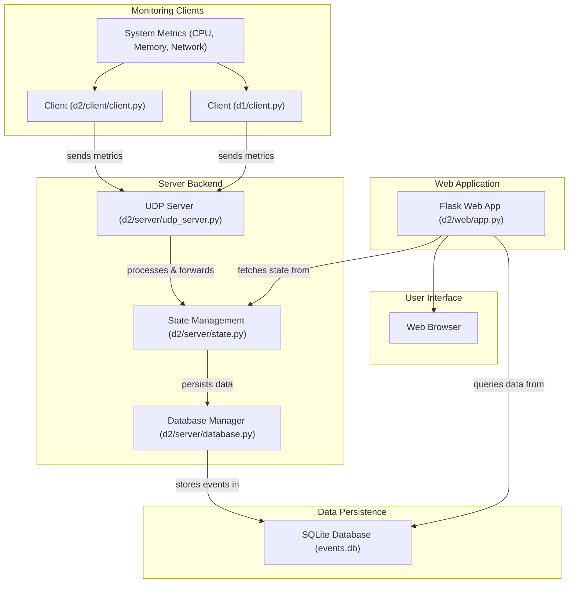

# Network Monitoring System

A real-time system for collecting, visualizing, and analyzing network and host resource metrics.

## Executive Summary

The Network Monitoring System is a distributed application designed to provide clear, actionable insights into the performance and health of network hosts and their resources. It addresses the critical need for organizations to have real-time visibility into system metrics such as CPU usage, memory consumption, and network activity. The system achieves this through a client-server architecture where lightweight clients collect data from monitored machines and transmit it to a central UDP server. This server then processes and persists the incoming data, which is subsequently made accessible via a intuitive web-based dashboard. By offering a comprehensive overview of system status, this tool empowers administrators to proactively identify bottlenecks, troubleshoot operational issues, and optimize resource allocation across their infrastructure.

## Architecture Overview

The system operates on a client-server model, with a central server responsible for data aggregation and a web interface for visualization. Clients deployed on monitored hosts collect various system metrics and send them via UDP to the server. The server processes these events, manages system state, and persists the data into an SQLite database. A Flask web application then queries this database to present the real-time and historical data to users through a web browser.


*Architecture Diagram: Data flows from various monitoring clients (d1 and d2) which collect system metrics and send them to the central UDP Server. The UDP Server processes this data, updating the system state and delegating storage to the Database Manager, which persists events in an SQLite database. The Flask Web Application retrieves this data from both the database and the state manager to render an interactive dashboard viewable in a web browser.*

## Technical Stack

The Network Monitoring System is built using a combination of modern technologies for its backend processing, data storage, and frontend visualization.

### Backend & Server


### Database


### Frontend


### Testing


## Getting Started

To get the Network Monitoring System running locally, follow these steps.

### Prerequisites

Ensure you have Python 3.x installed on your system.

### 1. Clone the Repository

Begin by cloning the project repository to your local machine:

```bash
git clone https://github.com/kmanu28/NetworkMonitoringSystem.git
cd NetworkMonitoringSystem
```

### 2. Install Dependencies

It's recommended to set up a virtual environment to manage project dependencies:

```bash
# Create a virtual environment
python -m venv venv

# Activate the virtual environment
# On Linux/macOS:
source venv/bin/activate
# On Windows:
.\venv\Scripts\activate

# Install required Python packages
# (Assuming Flask for web and psutil for client-side system metrics)
pip install Flask psutil
```

### 3. Initialize the Database

The system uses an SQLite database (`events.db`) to store monitoring data. You'll need to initialize its schema:

```bash
python d2/server/database.py
```
This script is expected to create the necessary tables in `events.db`.

### 4. Run the Components

The Network Monitoring System consists of several independent components that need to be run concurrently. Open three separate terminal windows or tabs for the server, web application, and clients.

#### Terminal 1: Start the UDP Server

This server listens for incoming monitoring data from clients.

```bash
python d2/server/udp_server.py
```

#### Terminal 2: Start the Web Application

This Flask application serves the web interface for viewing monitoring data.

```bash
python d2/web/app.py
```
After running, the web application will typically be accessible at `http://127.0.0.1:5000` in your web browser.

#### Terminal 3: Start the Monitoring Client(s)

Run one or more client instances. Each client will collect system metrics and send them to the UDP server.

```bash
# To run the client from d2 directory:
python d2/client/client.py

# You can also run the client from d1 directory if desired:
# python d1/client.py
```
You can open additional terminals to run multiple client instances simultaneously, simulating a network of monitored hosts.

Once all components are running, navigate to `http://127.0.0.1:5000` in your web browser to view the monitoring dashboard.
